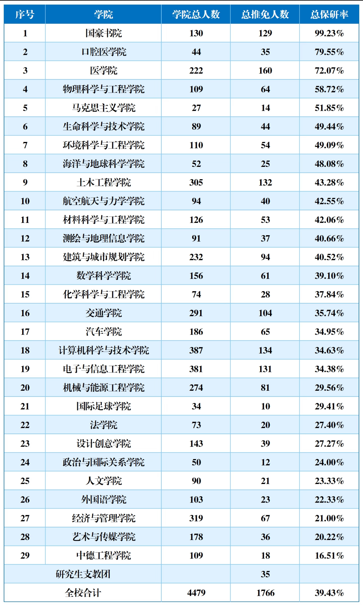

## 什么是保研？

保研的正式名称是“推荐优秀应届本科毕业生免试攻读研究生”，简称推免。学生先由本科所在学院评定并取得推免资格，再向本校或外校的研究生招生单位申请接收。取得推免资格不等于已经被研究生院校录取。

## 推免资格如何确定？

推免面向纳入国家普通本科招生计划的应届毕业生。学校重视学生的一贯学业表现，思想品德考核不合格者不予推荐。各学院根据当年名额和本学院实施办法计算综合成绩并排序，平均绩点通常是主要依据，科研成果、竞赛获奖、社会服务等可按细则计入。

不同学院的课程范围、加分项目、成绩比例和名额均可能不同。科研论文、竞赛等成果通常需要学院审核，部分成果还需公开答辩。网上流传的往年排名和“保研率”只能帮助理解竞争情况，不能代替本届实施办法。

## 基本流程

推免通常在大三结束后的秋季学期初集中开展：

1. 学院公布当届实施办法、名额和申请时间；

2. 学生提交申请及证明材料；

3. 学院审核材料、计算综合成绩并公示推荐名单；

4. 获得资格的学生通过教育部推免服务系统填报志愿；

5. 招生单位组织复试并发出待录取通知，学生在系统中确认。

## WIKI Tips

1. 想了解自己的竞争位置，应直接查看本学院最新推免办法和往届公示，跨学院数据通常没有可比性。

2. 课程成绩是长期积累。竞赛、论文或社会服务能否加分，以及加多少分，取决于学院当届细则。

3. “获得本校推免资格”和“被目标院校接收”是两个环节，应分别关注本科所在学院与目标院校的通知。

## 进一步探索

1. [同济大学本科生院](https://jwc.tongji.edu.cn/)

2. [教育部全国推荐免试攻读研究生信息公开暨管理服务系统](https://yz.chsi.com.cn/tm/)

3. 本科所在学院官网的“本科生培养”“教务通知”或“推免”栏目

4. 同济大学保研率（民间整理，仅供参考）

