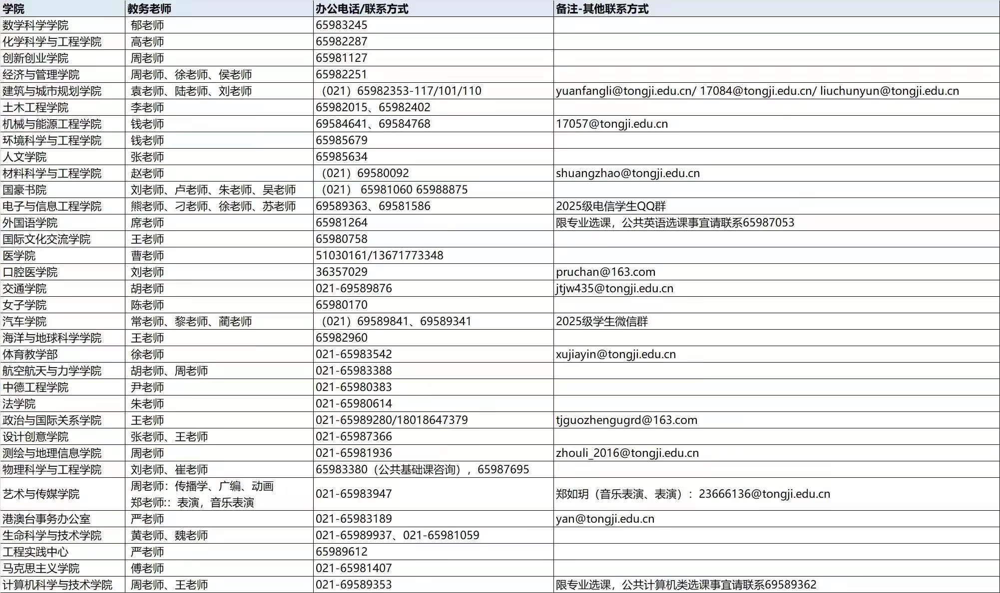

## 什么是课程？什么是培养？

**课程**是你在大学期间需要学习的教学单元，每门课程对应一定的学分。课程分为必修课和选修课两大类：

- **必修课**：培养方案中规定必须修读的课程，包括公共基础课（如思政、英语、体育）、专业基础课和专业核心课。不及格必须重修。

- **选修课**：在一定范围内自主选择修读的课程，包括通识选修课（跨学科）和专业选修课（本专业的拓展课程）。

**培养方案**（简称"培养"）是你所在专业大学四年的"学习路线图"，规定了：

- 毕业所需的总学分和各类课程的学分要求

- 必修课程清单及建议修读学期

- 选修课程的范围和最低学分要求

- 实践环节要求（实验、实习、毕业设计等）

每个年级、每个专业的培养方案可能不同，以你入学年份的版本为准。

## 如何查看我的培养方案？

1. 登录[同济大学教学管理系统](https://1.tongji.edu.cn)进入"培养管理"或"我的培养"模块；

2. 点击[本科生院培养方案](https://jwc.tongji.edu.cn/pyfa/list.htm)，查看任意专业培养方案

也可以在学院教务科网站或新生入学时发放的培养方案手册中查找。

## 课程类别与学分要求

同济大学本科课程一般分为以下几类：

|课程类别|说明|典型课程|
|---|---|---|
|公共基础课|必修|思政课、体育课|
|通识教育课|选修够固定学分|星期音乐会、性与健康|
|专业基础课|必修|专业导论、高等数学、编程|
|专业必修课|必修|专业概论|
|专业选修课|选修|专业前沿|
|实践教学环节|必修|实验、实习、毕业论文|

**学分要求**：不同专业差异较大，一般在 160-180 学分之间，具体以你的培养方案为准。

## 选课 Timeline

每学期选课前，教务处会发布选课通知。选课一般分为四轮，时间跨度从**期末到开学后第一周**：

### 选课时间线

#### 期末阶段（约开学前 2-3 个月）

- **开学前 10-12 周**：选课通知发布，查看培养方案、专业课表、全校课表，规划选课清单

- **开学前 8-9 周**：第一轮选课（约 2 天）

  - 全体学生参与

  - 课程不受容量限制，选课不分先后（摇号）

  - 系统会根据专业课表进行筛选

- **开学前 8 周**：第二轮选课（约 3 天）

  - 未选满课程不受容量限制（摇号）

  - 第一轮被筛选掉的学生需选择其他班级或课程

  - 按专业课表筛选

- **开学前 7-8 周**：第三轮选课（约 3 天）

  - 课程受容量限制，**先选先得**

#### 开学阶段

- **开学第 1 周**：新生选课 + 第四轮选课/补退选

  - 课程受容量限制，**先到先得**

  - 包括之前漏选体育课的学生

  - 这是最后的调整机会

- **开学第 1-2 周**：可通过教务退补选

  - 可以试听已选课程

  - 觉得不合适可以退课、改选

  - ⚠️ 注意截止时间，不要错过

- **开学第 3 周起**：选课基本确定

  - 进入正常教学

  - 之后一般不能再改选

- **开学第八周：**期中退课，可以退掉通识选修、专业选修等课程，只能退课，不能补选，最多退两门。

### 选课操作方式

1. 登录[同济大学教学管理信息系统](http://1.tongji.edu.cn)

2. 首页点击左上角菜单图标 → 我的选课 → 个人选课 → 选择课程

3. 选择"计划内课程"或"通识选修课" → 点击要选择的课程

4. 页面左边显示课程列表 → 点击某门课程 → 页面右边显示教学班级

5. 页面下方课表同时显示课程 → 保存课表 → 选课成功

### 我想选别的专业课，怎么办？

点击我的选课 - 跨学科选课申请 - 申请，本学院与开课学院教务审批通过后，可在计划内课程找到对应课程。

## WIKI Tips

- **培养方案是你的底线**：选课前务必对照培养方案，确保每学期修够学分，尤其注意先修课程要求。

- **通识课别拖到最后**：通识选修课需要在毕业前修满规定学分，建议大一大二早早开始修读。

- **选课系统会卡**：热门课程（如热门通识课、名师专业课）开抢时系统可能拥堵，提前登录、多刷新、准备备选方案。

- **先试听再决定**：开学前两周可以试听，觉得不合适可以退课改选，但注意不要超过截止时间。

- **必修课不能随便退**：必修课一般由教务预置，不要误退；如有特殊情况需联系教务老师。

- **关注学分上限**：每学期有学分上限，超选需要申请。

- **重修与补考**：必修课不及格需要重修，选修课不及格可以改选其他课程。注意可能需要额外缴费。

## 进一步探索

1. 选课网站：[YOURTJ 选课社区](https://xk.yourtj.de)

2. 选课交流 QQ 群：791913730（一群）985361667（二群）

3. 教务联系方式（在外打电话若失败，请添加 021 上海区号）：

   

4. 本科生培养方案：[本科生院培养方案](https://jwc.tongji.edu.cn/pyfa/list.htm)

5. 教学管理系统（1 系统）：[同济大学教学管理系统](http://1.tongji.edu.cn)
