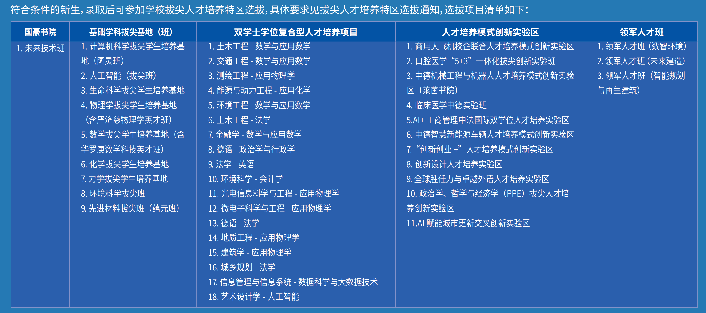

# 转专业

由于同济大学转专业相关规定较为复杂,本文以官方规定详细阐述我校转专业政策,长文预警。

## 转专业 Timeline 及基础规则

同济大学本科阶段的专业调整由几套性质不同的制度共同构成。新生入学前后参加的校内二次选拔,改变的是培养项目或培养模式;大类学生在第一学年末完成主修专业确认,其中包含类内确认与跨类确认;进入二年级后,学生再依照学籍管理规定申请转专业。几条路径发生在不同年级,适用对象、考核方式和学籍结果也各不相同。把它们统称为"转专业"便于日常交流,理解制度时仍需逐项区分。

| 阶段 | 制度名称 | 主要对象 | 确认范围 | 制度结果 |
| --- | --- | --- | --- | --- |
| 新生入学前后 | 校内二次选拔 | 符合项目报名条件的本科新生 | 拔尖基地(班)、双学士学位项目、人才培养模式创新实验区等项目 | 进入新的培养项目,通常不再按原录取专业或大类培养 |
| 第一学年第二学期 | 类内主修专业确认 | 按专业大类招生并需要参加确认的学生 | 本人所在大类包含的专业 | 确定大类内的主修专业 |
| 第一学年第二学期 | 跨类主修专业确认 | 有类外专业志愿且具备报名资格的学生 | 本人所在大类以外开放接收的专业 | 跨出原大类,确定新的主修专业 |
| 二年级及以后 | 转专业申请 | 符合学籍管理规定和接收学院条件的学生 | 当期公布接收方案的专业 | 经学院考核与学校审批后变更主修专业,并由接收学院确定就读年级 |

### 大一开学前后:校内二次选拔

校内二次选拔发生在本科培养正式展开之前。学校通常在新生报到前后发布拔尖人才培养特区报名通知,由各项目分别公布招生对象、名额、科类要求与考核办法。二次选拔常被称作新生的第一次"转专业机会",在入学前直接编入新班级。参加二次选拔后依然可以继续参加主修专业确认(只有跨类环节),所以,如对本专业不满意,也可寻得"跳板"。

根据 2026 年 8 月 10 日 12 点统计到的数据,各特区报名热度如下:

二次选拔也不向所有新生开放。项目会设置科类、高考分数要求,部分招生类型还受原有招生类型限制(如国豪书院未来技术班要求高考录取工科试验班(国豪精英班))。2026 年校级通知规定,除项目另有说明外,入学后限制调整专业的学生,以及国家专项、高校专项、机械类(中外合作办学)、临床医学(5+3 一体化)、第二学士学位等类别的学生不得报名。专项计划学生能否参加某一项目,需要同时核对校级通知、项目简章和本人录取约定,不能将其他学生的报名经历直接套用。

二次选拔可以在招生过程中和老师签约,具体请在志愿填报期间咨询招生组。

### 大一下学期:类内主修专业确认

类内分流的正式名称是类内主修专业确认。按专业大类招生的学生在大类培养阶段结束前,从大类所包含的专业中确认主修专业。2025 级主修专业确认安排在第一学年第二学期,类内与跨类志愿同步填报,录取按照先类内、后跨类的次序进行。类内确认承担专业归属的确定功能。学生须将类内所有专业按志愿顺序填满,系统再结合专业接收计划和类内综合成绩完成录取;未完成填报的学生,可能由工作小组依据剩余计划统筹安排。

类内志愿采用顺序志愿逻辑。系统先处理各专业的第一志愿,按综合成绩从高到低录取至计划数满;仍有名额的专业再处理第二志愿,后续志愿依次类推。学生一旦被某个前序志愿录取,便不再参加后序志愿录取。填满全部专业保证每名需要参加类内确认的学生都能形成一个类内录取结果,却不意味着每个人都能进入第一志愿。

类内录取依据综合评价,不只比较平均绩点:

| 板块 | 最低占比 | 备注 |
| --- | --- | --- |
| 学业成绩(GPA) | 60% | 大一所有修读的课程全部计入,包括公必/公选/专必/专基/特色模块/实践/专选。以 zzfw 系统中计算的百分制成绩为准,即 95 满分制 |
| 面试成绩 | 10% | 以 0.1 位档次进行打分 |
| 五育(卓越星) | 10% | 每个板块星点值不低于 20,负面清单扣分 |
| 特色测评 | 10% | 以学院通知为准,以竞赛、指标课程(数学、物理)为标准 |

部分学生不参加常规类内确认。2025 级办法规定,录取通知书已有明确专业属性,以及通过招生或二次选拔进入基础学科拔尖基地(班)、双学士学位项目、人才培养模式创新实验区的学生,不参加类内主修专业确认,但在具备资格时可以参加跨类确认。经济管理试验班、建筑类等大类的类内选择方式也有专门规定。学生需要先判断自己是否属于类内确认对象,再理解所在大类的专业范围和排序规则。

2026 年,同济大学的类内分流政策为:

1. 按顺序志愿,每个专业为一个志愿分流:医学试验班、人文科学试验班、机械类(中外合作办学);
2. 按顺序志愿,每个学院为一个志愿分流,学院内专业任选:工科试验班(计算机与电子/机器人与智能制造/光电与空天信息/智能交通与车辆)、理科试验班;
3. 按顺序志愿,每个领域为一个志愿分流,领域内专业任选:工科试验班(卓越计划班);
4. 直接录取学生第一志愿,即专业任选:工科试验班(国豪精英班/智慧建造与低碳环境)、经济管理试验班、建筑类;
5. 获得新生奖学金,且大一学年结束时绩点在分流范围前 50% 的,优先录取第一志愿(近似于任选)。

### 大一下学期:跨类主修专业确认

> 省流:**类内先兜底,跨类报三个;offer 能打牌,排位高先录;确认废类内,落空保类内。**

跨类分流的正式名称是跨类主修专业确认。它与类内确认处于同一工作周期,面向对类外专业有浓厚兴趣或突出专长、同时符合报名限制的学生。2025 级学生最多可以填报 3 个跨类专业,志愿在填报阶段不分先后。各接收学院分别制定实施方案,公布接收计划、课程要求、综合成绩构成、面试与特色评测方式。专业之间的考核差异可能较大,有的侧重第一学年整体学业成绩,有的提高数学、物理、程序设计等指标课程的权重,也有专业设置机试、作品评审或专门面试。

学校对跨类综合成绩规定了原则性框架:

| 评价板块 | 最低占比 | 谁在这加了占比? | 备注 |
| --- | --- | --- | --- |
| 学业成绩 | 50% | 90%:中德;70%:汽车、电信、材料、测绘、环境、生命、医学;60%:交通、艺传;55%:计软 | 无 |
| 五育分 | 10% | 无 | 无 |
| 面试 | 10% | 40%:马克思;30%:人文、外语、法学、国政、海洋、航力、化学、口腔、物理;20%:机械、交通、经管、艺传 | 机械学院理工类转入 4.0 免面试,人文社科不适用 |
| 特色测评 | 10% | 30%:设创、建筑、土木、数学;25%:计软;20%:经管 | 均包含笔试环节 |

具体人数随专业、年度和在读规模变化。现有名额表可以帮助读者理解数量级,不能代替当年系统公布的接收计划。

跨类录取包含"预录取"和"确认"两个环节。学院按跨类综合成绩排序,划定预录取合格线并公布排序名单。预录取人数可以多于专业实际接收计划,因此取得预录取资格只代表学生可以进入确认环节。具备资格的学生分三批确认,每一批只能确认一个跨类专业;系统在该专业接收计划内按排序录取。已经被某个跨类专业正式录取的学生不再参加后续批次,尚未录取且仍持有其他专业预录取资格的学生可以继续确认。三批结束后仍未获得跨类录取,学生保留先前形成的类内录取专业。

跨类确认具有明确的结果约束。学生如不希望接受某个跨类结果,可以不参加该专业的预录取确认;一旦完成确认并被正式录取,原类内专业自动放弃,学籍转入跨类录取专业。

**跨类后的就读年级由个人自愿选择,不可以编入高年级。** 是否降级与"转专业难度"无关,如学院没有特殊规定,是否降级由个人自行决定。即使是部分在跨类方案中已经明确降级转入的专业,也可以开学通过"跳级申请表"恢复原年级。

提前批、特殊招生与带有专业限制的学生还需核对资格。2025 级办法明确,马克思主义理论、康复物理治疗、护理学等提前批次专业,第二学士学位学生,艺术类(除广播电视编导)专业学生,运动训练专业学生及保送生不参加跨类主修专业确认,也不得转专业。

### 大二、大三:申请转专业

大二、大三的专业调整适用本科生学籍管理规定中的转专业程序。这一路径面向二年级以上学生,与第一学年末面向大类学生统一开展的主修专业确认分属两套制度。学校列出五类申请理由:对其他专业有浓厚兴趣,在其他专业有突出专长,在所在专业学习困难,参军退役后复学,以及休学创业后复学。因兴趣申请的学生还须满足接收专业提出的修读课程、平均绩点等报名条件;以专长或学习困难为由申请,需要提交足以说明相关情况的材料;创业复学学生需要证明转入专业有助于创业发展。退役复学条款所指对象为复学至一、二年级的学生。

申请时间随理由而变化。因"对其他专业有浓厚兴趣"申请转专业,只在每学年第二学期开学后第一周受理。因突出专长、学习困难、退役复学或创业复学申请,可在每学期开学后第一周提出。日常所说的"大二、大三每学期都能转"省略了这一差别。各学院还会依据学校规定制定当年的接收方案,列明开放专业、课程基础、绩点门槛、材料要求和考核办法。达到学校层面的申请条件只取得报名资格,接收学院仍需通过材料审核、笔试、面试或综合考察决定是否接收。

跨学院转专业需要依次经过原学院、本科生院和接收学院。学生向所在学院提交申请,原学院审核后交本科生院复核,本科生院再转送接收学院考察;接收学院给出是否接收的意见,并在同意接收时提出年级安排;本科生院审核后报分管校领导审批。同一学院内部调整专业,由学院分管领导审批并报本科生院备案。接收学院提出的年级安排决定学生是否降级以及后续如何补修课程,因此录取与年级安排是同一审批过程中的两个判断。

大二、大三转专业没有统一的全校绩点线,也不能用某个专业往年的录取结果推导全校难度。接收条件由学院按专业制定,同一学院不同年份也可能调整。课程成绩、专业基础、申请材料与学院考核共同影响结果,录取后的课程认定、补修范围和就读年级同样需要由相关学院确认。

## WIKI Tips

1. "二次选拔""主修专业确认"和"转专业申请"属于不同制度。判断自己适用哪一条路径时,应先确认年级、招生类型和当前专业归属;
2. 类内与跨类确认的综合成绩比例、特色评测方式和接收名额按年级制定。往年文件可以帮助理解制度,不能代替当年通知;
3. 对于文社科同学来说,绩点 4.6+ 是一个转专业的良好基础,绩点越高越好;
4. 预录取资格不等于正式跨类录取。学生完成确认并被跨类专业正式录取后,原类内专业自动放弃;
5. 是否降级由接收学院结合培养方案差异确定。转入结果与年级安排需要分别确认;
6. 大二、大三因兴趣申请转专业,只在每学年第二学期开学后第一周受理;其他法定情形可在每学期开学后第一周申请。大二、大三的转专业难度相较于大一跨类分流有所下降,但仍需警惕学院卡转出的情形;
7. 需要注意的是,同济大学的"降转"与"平转"没有区别,先获得转专业资格,才决定是否降级。

## 进一步探索

1. [同济大学本科生学籍管理规定](https://xxgk.tongji.edu.cn/index.php?classid=11607&newsid=18858&t=show)
2. 同济大学转专业交流 QQ 群:910177757
