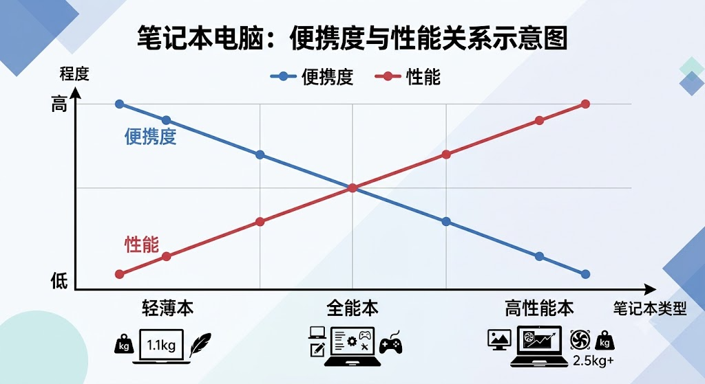

## WIKI Tips

对于绝大部分大学生活所需的学习工作来说，最好有一台笔记本电脑。如果你已经有台式/PC 并搭配 iPad 移动使用也不失为良好的选择，这里按下不表。

关于选择笔记本的教学有很多，这里 WIKI 着重推荐“笔吧评测室”[@bilibili](https://space.bilibili.com/367877?spm_id_from=333.337.0.0) 账号，购置什么笔电需要结合你的预算和需求产生。理工科优先推荐高性能笔记本，文社科、设计可以考虑轻薄本，但通常此类笔记本不能很好地满足进阶剪辑、建模、娱乐（特别是游戏）的需求，需要谨慎考虑。

文社科、设计类同学也可以选择 Mac 作为主力，但需要着重考虑 Mac 糟糕的游戏生态，也推荐参考笔吧评测室的视频。
