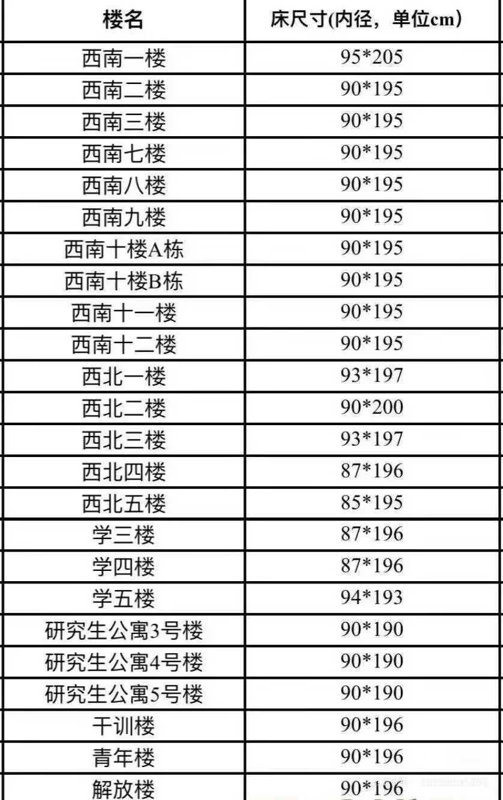

## 校区与宿舍分配

大一新生绝大多数住四平路校区。大二根据专业重新安排（如医学生搬至沪西），部分入住彰武校区。

研究生住在复试所在校区（录取通知书上能看到）。大致分布：

## 住宿费

同济大学的住宿费**约** 1200 元/年，具体以缴费系统通知为准。

## 空调

宿舍空调需另行租赁，前往各校区格力空调租赁点办理。咨询电话：021-65989809。

## 床铺尺寸

各楼栋床铺尺寸不同，查到宿舍后根据具体楼栋购买床垫（尽量买小不买大）。床帘建议入住后再买，每间宿舍床到天花板距离、有无支架都不一样。

## 关于独立卫浴

📝 待补充

## 四平路校区

宿舍楼包括：西南 1-3、西南 7-12、西北 1-5、学 3-5、彰武、铁岭、博士楼、解放楼、干训楼、青年楼。

### 西南片区

**西南 1-3**（一、二男寝，三女寝）

4 人寝，上床下桌，无阳台（有窗户），无独卫，有空调。

楼内设施：

- 自习室：西南一每层一个自习室+活动室，四楼有大自习室；西南二三自习室在一楼

- 公共浴室：一楼

- 晾衣间：每层两个，各配一台烘干机

- 洗衣房：一楼（西南一有 5 台洗衣机+1 台洗鞋机）

**西南 7**（男）

4 人寝，上下铺，有阳台，无独卫，有空调。

楼内设施：

- 洗衣机 7 台+烘干机 1 台

- 吹风机 4 个（浴室门口）

- 厨房：热水机、微波炉、电磁炉各一；冰箱 2 台（生熟分开）

- 公共浴室：一楼，约 30 个水龙头，隔间有布帘

**西南 8**（男）

四人间。左侧上楼（X01-X29）上床下桌，右侧上楼（X30-X54）上下铺。有独卫（蹲坑）。

楼内设施：

- 洗衣机：1-3 楼每层 2 台

- 厨房：一楼（微波炉、售货机、电磁炉），有小冰箱但不建议放东西

- 公共浴室：一楼，15:30-23:00，有吹风机（校园卡全天可用）

- 自习室/活动室：二楼，全天开放

- 内部庭院可打羽毛球

**西南 9**（女）

4 人间，有独卫（无热水），有阳台（带水槽和晾衣杆）。01-12、31-39、13-29 为上床下桌，40-51 为上下铺。

楼内设施：一楼有 3 台洗衣机、厨房（微波炉、电磁炉，一卡通使用）。

### 西北片区

#### 西北 1-2

4 人寝，上床下桌，无阳台无独卫。两栋楼内部一样。

楼内设施：洗衣房、厨房（售货机/微波炉/电磁炉/热水机/冰箱）、自习室、公共浴室（有吹风机）。另有健身房和爱心屋。

#### 西北 3

四人间和二人间混合，上床下桌，无阳台无独卫。

楼内设施：洗衣房（6 台洗衣机）、厨房（热水机/冰箱）、活动室。

#### 西北 4

双号房四人寝，单号房三人寝，上床下桌，无阳台无独卫。

#### 西北 5

四人寝和三人寝混合，上床下桌，无阳台无独卫，窗外有晾衣杆。四人寝总面积大，但人均面积和三人寝差不多。

西北片区各楼公共设施：洗衣机、冰箱、吹风机、洗衣房、厨房、自习室、公共浴室，大多在一楼。

### 学片区

#### 学 3、学 4

4 人寝，上床下桌，无阳台无独卫（每层有公共卫生间），空间较小。

楼内设施：洗衣房（6 台洗衣机+1 烘干机）、厨房（微波炉/热水机/2 小冰箱）、公共浴室（多隔间+置物柜+吹风机）。

#### 学 5

4 人寝，上床下桌，无阳台无独卫（每层公共卫生间），共四层。

楼内设施：公共浴室、一楼和三楼自习室、一楼瑜伽室和研习室。

### 青年楼、解放楼、干训楼

这三栋原为教职工住宿楼，现作学生宿舍。

- **青年楼**：上下床，近年翻新，有独卫+热水器（随时可洗），地理位置好。

- **解放楼**：上下床，近年翻新，有独卫+热水器，离哪都近，空间较大。

- **干训楼**：四床三人桌，有独卫+热水器，无阳台（床 90×196cm），也有极少两人间。

### 彰武

女生宿舍：1、2、7、10 号楼；男生：5、6、9 号楼；混寝：3、8 号楼；留学生：4 号楼。

主要房型为三人寝，上床下桌，有独卫，有阳台，电梯楼（3 部电梯）。部分二人寝（1/2/3/5/6 号楼正陆续改为三人间）。

楼内设施：

- 热水房：每隔五层一个，刷卡 0.2 元/L

- 洗衣房：一二楼，约 6-7 台洗衣机+1 台烘干机（3/4/5 元三档）

- 一楼大厅有贩卖机

- 8 号楼配置较好：健身房、咖吧、书局、研习室、琴房、党建室

### 铁岭博士公寓

女生：5/6/7 号楼；男生：8 号楼；混寝：12 号楼。

公寓式布局，每层 3 个套间，分单人间和双人间。有阳台、独卫（马桶），上床下柜。每套间含 1 客厅+1-2 卫浴+2-5 间宿舍，可自购冰箱洗衣机，不限电器功率，电费水费自付。部分房间不配空调。

注意：铁岭是 1997 年建成的商品房，学校租赁使用，设施偏老旧，距四平路校区比彰武稍远。

楼内设施：楼下 2 台洗衣机（刷卡）、打热水处（刷卡）、微波炉。

### 博士楼

单人间和双人间，套间式公寓，上床下柜，有公共/室内阳台。3-5 个房间共用 1-2 个卫浴。

### 三好坞宿舍（留学生）

1、2 号楼，房型有双人学生房、单人学生房、双人标准间、双人套间。房内配独卫、冷暖空调、24 小时热水。每层有公共厨房（微波炉/电磁灶）和自助洗衣房。

## 嘉定校区

宿舍楼包括：友园（1-20 号楼）、朋园（1-7 号楼）、天骄公寓。

### 友园

#### 友园 1-3

友园 2：两头单人寝，中间双人寝。友园 3：全是单人寝。有独卫、空调、室外阳台。

楼内设施：公共厨房、吹风机、洗衣房、开水房。

#### 友园 4-6

四人寝，上床下桌，有阳台，无独卫（每层公共厕所，7 个蹲坑），空间大。两张床中间的储物格兼做梯子。

楼内设施：

- 洗衣机：每层 1 台；5 号楼一楼洗衣房（数台洗衣机+1 烘干机）

- 厨房：5 号楼一楼（2 冰箱/微波炉/电磁炉/洗碗池/桌椅）

- 澡堂：5 号楼一楼（5 个吹风机）；4-5 号楼连接处有单独吹风间

#### 友园 7-8

四人间，上床下桌，有室内阳台，有独卫（马桶）+淋浴间（有热水）。奇数号房间为阳面。4 人共用 2 个大储物柜（100×50×85cm），每人桌下有小衣柜（60×60×150cm）。

楼内设施：

- 洗衣机分布在 7 号楼 2/4/6 楼和 8 号楼 2/4/6 楼

- 冰箱和厨房：7 号楼 3 楼

- 吹风机：仅 4 个（7-8 号楼连廊处）

- 7 号楼 1 楼有自习室

#### 友园 9-10

一楼为研究生（两人间），其余为本科生（四人间）。上床下桌，独卫（马桶+带隔帘淋浴），双台盆洗脸台，有空调和热水器。

楼内设施：2/4/6 楼洗衣机，3 楼公共厨房，1 楼自习室+小花园。

#### 友园 12

1 楼双人间，其余三人间（一个上床下桌+一个上下铺）。每人有衣柜和桌子，无阳台（室内可晾衣），有空调、热水器、独卫。

楼内设施：2-7 层均有洗衣机；一楼厨房（2 冰箱/微波炉/电磁炉）。

**友园 13**（2025 年新修缮）

单人间，博士宿舍。有阳台、独卫、热水器、空调、电扇、校园网。

楼内设施：洗衣房、开水房、吹风机。

#### 友园 14-15

1-4 楼三人间（本科生，一个上床下桌+两床两桌），5-7 楼两人间（研究生，两床两桌）。有独卫（马桶）、热水器、阳台、空调。

楼内设施：2/4/6 楼洗衣机+烘干机+热水机；二楼活动室+大镜子+4 个吹风机。

**友园 16-18**（2025 年新修缮）

2 人寝和 3 人寝混合。单数房号向阳，双数向阴。独立书桌，无独卫。家具近年陆续翻新，改造完毕后统一为三人寝。

楼内设施：

- 每单元一个洗衣房

- 三栋楼共用一个厨房（进门大厅右手，有电磁炉/微波炉/冰箱）

- 公共浴室：17 号楼 2 单元一楼，15:00-23:30，单独隔间有帘子

#### 友园 19-20

四人间，上床下桌，有小阳台（可晒衣服），有独卫（马桶），有空调和电扇。两人分一个柜子。

楼内设施：共 6 台洗衣机；宿管值班室有微波炉；二楼 5 个吹风机+办公室。无公共浴室。

### 朋园

#### 朋园 1

一人寝和二人寝（大部分 2 人），上下铺，有阳台，有独卫，24 小时热水。有高 2 米的大衣柜。

楼内设施：洗衣机 4 套、吹风机一排、宿舍之家活动中心。

#### 朋园 2

两人寝或单人寝，有开放式阳台，独卫（马桶），热水即开即有。独立床+独立书桌，床下和衣柜顶有储物空间。5 层楼，每层 60 余间房，单数阳面偶数阴面。

楼内设施：洗衣机 6-7 台、干衣机 2 台、吹风机 5 个、售卖机 1 台、体重秤 1 个。楼后有很多晾衣架可晒被子。

#### 朋园 6

四人寝，上下铺，有开放式阳台，独立卫浴，24h 热水。网吧四人联排桌。男女混楼。

楼内设施：洗衣机男女目测各不少于 20 台，干衣机不少于 4 台，洗鞋机一台。

### 天骄公寓

地址：曹安公路 4821 号（嘉定校区旁），学校首个大学科技园内宿舍。3-26 层为宿舍区，共 570 间，可容纳约 1700 人。刷校园卡进门禁，5 台电梯。

房型：三人间，上床下桌，有独立阳台和卫生间（干湿分离），门口有洗手台。配全套家具+阶梯储物空间，空调、热水器、网络齐全。

## 沪西校区

宿舍楼包括：生乐 A 区（女生）、生乐 B 区（男生）、1/2/3/4 号楼、11 号楼。

### 生乐 A/B 区

套间布局，每套间 3-4 室，上床下桌。配有洗漱池、电热水器、淋浴位、独立厕所。公共空间电费由套间学生共担。

楼内设施（一楼公共功能区）：

- 备餐间：电磁炉、微波炉、冰箱、开水箱、桌椅

- 自习室：A9、A10、B15、B16 号楼一层

- 洗衣房、晾衣间

- 4 号楼、19 号楼一层：开水房+洗衣间（24 小时），有饮水机、洗衣机、烘干机

值班电话：A 区（女生）021-51030513；B 区（男生）021-51030523。

### 1-4 号楼

二人间。

楼内设施：

- 浴室：3/4 号楼一楼，16:30-23:30，一卡通刷卡，有吹风机和智能更衣柜

- 备餐间：1/2 号楼一楼（扫码/一卡通），电磁炉/微波炉/冰箱/开水箱/桌椅

- 洗衣房：3/4 号楼一楼（扫码预约），洗衣水池/洗衣机/烘干机

- 党建活动室：1/2 号楼一楼（需提前审批）

### 11 号楼

四人间，上下铺。

楼内设施：

- 浴室/备餐间/洗衣房均在一楼

- 自习室：一楼，3 间（每间 10 套桌椅）

### 沪西公共浴室

开放时间：14:00-20:00，一卡通刷卡，有隔间、吹风机、置物柜。

男生可进 1/3 号楼使用功能区，女生可进 2/4/11 号楼。值班电话：021-51030633。

## 沪北校区

第一宿舍楼（男生），第二、三宿舍楼（女生）。

- 第一宿舍楼：三人间和四人间，上下铺，无独卫

- 第二、三宿舍楼：三人间和四人间，上床下桌，无独卫

均需去公共澡堂洗澡。

楼内设施：洗衣机、自助厨房（微波炉/冰箱/电磁炉）、热水饮水机。

公共澡堂开放时间：15:00-23:00。

## 国际学生公寓

地址：杨浦区翔殷路 888 号（五角场附近，地铁 10 号线五角场站步行约 10 分钟）。

5 栋宿舍楼，519 套房间，757 个床位。房型有标准双人间、标准单人间、loft 单人间，面积 15-32㎡。"一房一价"，**月租 3000-5000 元不等，同济大学并不存在优待国际生的情形，他们的宿舍真的很贵**。

## WIKI Tips

- 四平路校区老楼（西北、学片区）没有独卫，但公共浴室隔间够用。

- 西南 8 和西南 9 是少数有独卫的本科生宿舍，但西南 9 的独卫没有热水。

- 嘉定友园 7-8、9-10、12、14-15、19-20 都有独卫+热水，条件在本科宿舍里算好的。

- 友园 16-18 没有独卫，公共浴室在 17 号楼，15:00 才开。

- 彰武校区是电梯楼，三人寝+独卫，研究生住着比较舒服。8 号楼配置最豪华。

- 铁岭宿舍不限电器功率，但房子老，做好心理准备。

- 空调是租的，不是自带的，入住后去租赁点办，如果不办理会拆除。

- 大一新生宿舍分配由学院统一安排，入学前通过迎新网/管理平台查具体楼栋和房间号。

- 大二、研究生可以自组队宿舍，但一般是院内组队。

## 进一步探索

- 新生查宿舍/研新选宿舍：<https://yzssq.tongji.edu.cn>

- 空调租赁咨询：65989809

- 宿舍问题咨询：各校区宿舍公寓部服务窗口
