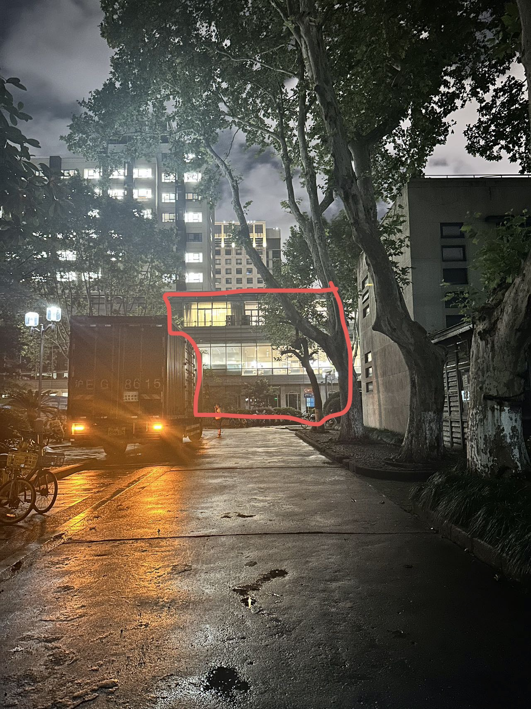

## 四平路校区（含南校区、阜新路校区）

### 快递

四平路校区的快递驿站在三好坞景观餐厅后，自 2026 年该驿站启动以来，已实现 24 小时取件服务与 8-20 点的人工服务。该驿站兼顾取件与寄件功能，需要在淘宝/菜鸟中使用收件手机注册的账号扫描身份码完成取件。

快递号五天内有效，超出五天后可在终端查询包裹情况，届时不需要扫码出库。

快递地址：上海市（市辖区）杨浦区四平路街道（四平路 1239 号）同济大学四平路校区（菜鸟驿站），括号内内容选写。

菜鸟驿站 24 小时提供取件服务，8:30-20:30 提供寄件服务，有中通、京东、顺丰可选，京东、顺丰大致在 9:00-18:30 营业。

#### 我找不到三好坞驿站

1. 导航至三好坞景观餐厅

   

   

2. 在三好坞餐厅一楼右侧（与城规学院 B 楼）中间道路向内走。

   

   左转。

   

   

   标红建筑为菜鸟驿站。

   目前驿站西侧因留学生公寓正在装修无法通行，此攻略为东门走法，西门通行时间不详。

#### 驿站取件方法

1. 下载淘宝 app，使用收件电话登录，点击菜鸟驿站快应用。

   

2. 点击身份码，在驿站西侧前台自助服务机扫描身份码和快递面单取件。也可在服务时间求助工作人员。

   若到站 120 小时后未扫码出库的包裹，将被驿站自动释放出库，但驿站一般不会清理，可以继续存放，但是需要自行保存或在前台搜索包裹位置，请注意包裹停留时间。

   

   关于东区的快递问题，设计创意学院有快递投递点，但原则上不允许学生使用，目前东区没有学生可用的快递服务，暂时可以地址写在东区，会放在 D 楼楼下。

### 外卖

1. 四平路南门/南校区：赤峰路 50 号门有一排三个外卖柜（ABC）

2. 阜新路校区（东区）：设计创意学院西侧入口有外卖放置点，在阜新路大门外有外卖柜

3. 四平路北门：北设计中心对面的北一门有一个外卖柜，服务西北片区同学

正门不允许放外卖，但是正门对面的联广好像有外卖柜。

四平路校区的外卖柜都是美团外卖柜，需要使用微信扫码，输入手机尾号开柜，但不是美团的订单似乎不能放进去。校内可以选择订购美团闪购，疑似可以直接送到校内，直接填写楼栋地址。

## 彰武路校区

彰武西门有外卖柜。

## 嘉定校区

快递：菜鸟驿站位于友园 10 号楼北侧。

外卖：外卖架位于嘉实广场星巴克门口。

## 沪西校区

## 沪北校区、临港与张江基地

---
