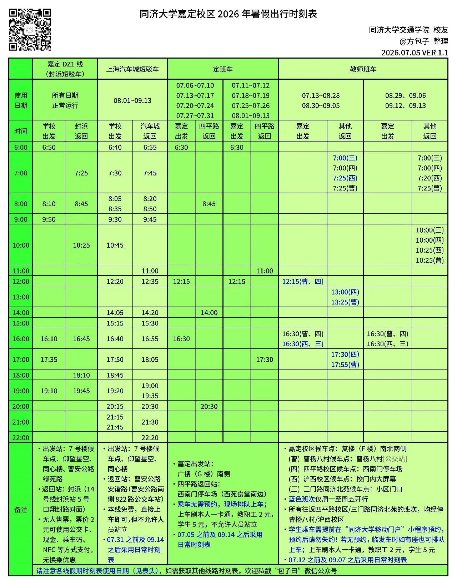

同济大学现有四个主要校区，分布在上海三个区。

## 四平路校区（本部）

地址：杨浦区四平路 1239 号。

这是同济的主校区，绝大多数行政机构、主要院系和历史建筑都在这里。地铁 10 号线"同济大学"站出站即到，交通最方便。

彰武校区在四平路校区大门直走直到彰武路，离四平主校区约 1 公里，为研究生试验、学生住宿、本科生工程实践提供教学科研支持。

## 嘉定校区

地址：嘉定区曹安公路 4800 号。

嘉定校区距四平路校区约一个半小时车程，主要承载汽车与能源学院、交通学院、计算机科学与技术学院（软件学院）等院系。校区面积大，建筑新，但周边配套一般，地理位置较为偏远。

## 沪西校区

地址：普陀区真南路 500 号。医学院在此驻扎。

## 沪北校区

地址：静安区中山北路 727 号。口腔医学院、继续教育学院在此驻扎。

## 其他研究所

1. 临港基地：📝 待补充

2. 张江基地：📝 待补充

## 校区间班车

校区之间运行班车。

## WIKI Tips

- 各校区之间的班车收取一定费用，目前定价为 5 元/次。

- 不建议携带杯饮乘坐班车，至少不要拿在手上，否则可能遭司机拒载。

## 进一步探索

- 推荐关注：微信公众号 -“包子曰”，由同济学长运营，更新同济交通信息。

- 推荐关注：小红书账号 -“同济交协”，更新同济出行信息。
